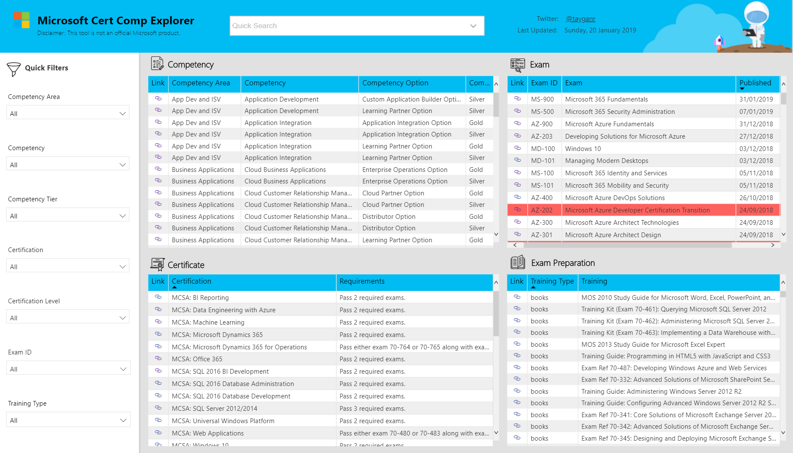
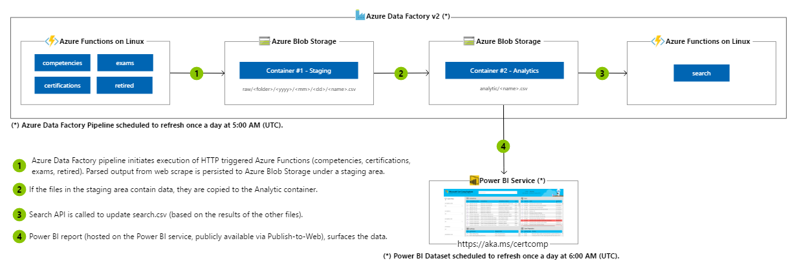

# CertComp Explorer

[CertComp Explorer](https://aka.ms/certcomp) allows you to interactively navigate Microsoft's [competencies](https://partner.microsoft.com/en-us/membership/competencies), [certifications](https://www.microsoft.com/en-us/learning/certification-overview.aspx), and [exams](https://www.microsoft.com/en-us/learning/exam-list.aspx). The source code shared via this repository contains the underlying logic used to scrape and parse the various sources.

## Features

* Use the **Quick Filters** on left hand side to focus the results by selecting values within a dropdown menu (e.g. Competency Area = Cloud Platform & Infra; Competency = Cloud Platform; Competency Tier = Gold).
* Use the **Quick Search** at the top to focus the results by entering a search term (e.g. "Data Factory).
* Select a row within one of the tables to see related entities (e.g. click "MCSA: Office 365" wihtin the certificate table to show related competencies, exams and preparation material).
* Open the related website by clicking on the **Link**, located in the first column of each row.
* Exams that are scheduled to **Retire** will be highlighted in red.

## Architecture

## Technologies

* Azure Functions on Linux
* Azure Blob Storage
* Azure Data Factory
* Power BI
* Application Insights

## Feedback

*  Reach me on Twitter [@tayganr](https://twitter.com/tayganr)
